# End to End CICD Project Pipeline  - Spring Boot based Java web application
 
This is a simple Sprint Boot based Java application that can be built using Maven. Sprint Boot dependencies are handled using the pom.xml 
at the root directory of the repository.

This is a MVC architecture based application where controller returns a page with title and message attributes to the view.


## Prerequisite for this projects

Ensure you have the following prerequisites before proceeding:
**Java application** : code hosted on a Git repository
1. **EC2 Machine**: t2.lage size preferred. (8/GB RAM and 2 Core Processor)
2. **Docker Setup** on EC2 Machine.
3. **Jenkins Setup**: You can either manually install Jenkins or use a Jenkins image.
4. **GitHub Account**: You need a GitHub account to automate the pipeline.
5. **Kubernetes cluster** : (Minikube is fine)
5. **Argo CD** : (usig Argo CD operator operatorhub.com)

For more updates and projects, visit:
- 💾 [shaikhwaseem.com](https://shaikhwaseem.com)
- 💾 [YouTube Channel](https://www.youtube.com/@waseeemuddin)


Here are the step-by-step details to set up an end-to-end Jenkins pipeline for a Java application using SonarQube, Argo CD, Helm, and Kubernetes:

## Architecture Diagram
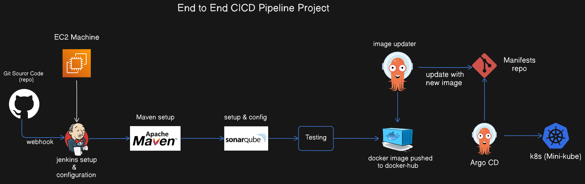

### Step 01 - Create EC2 Machine 
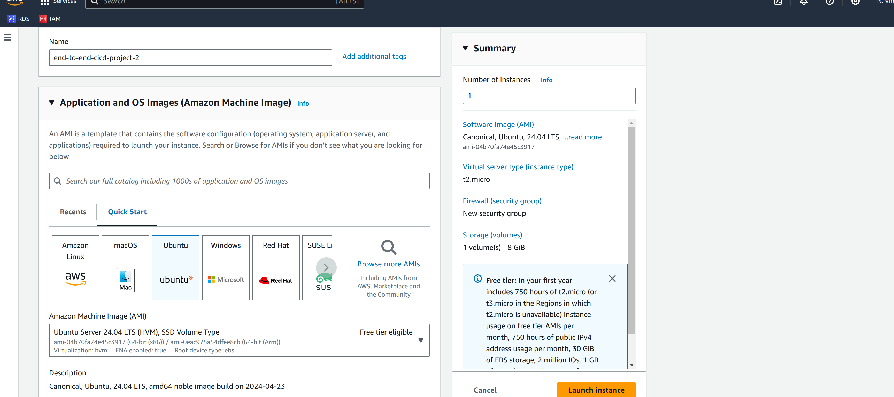
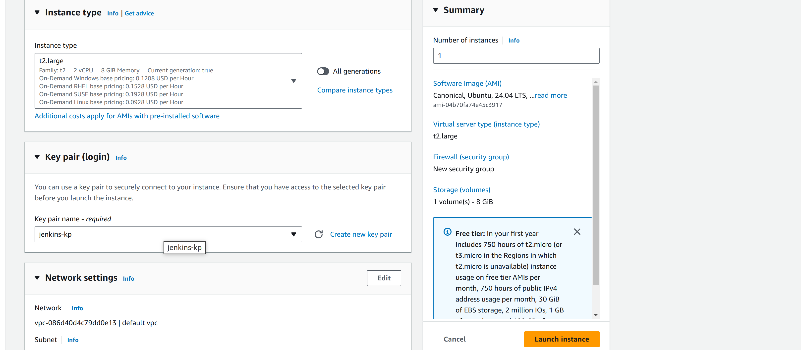
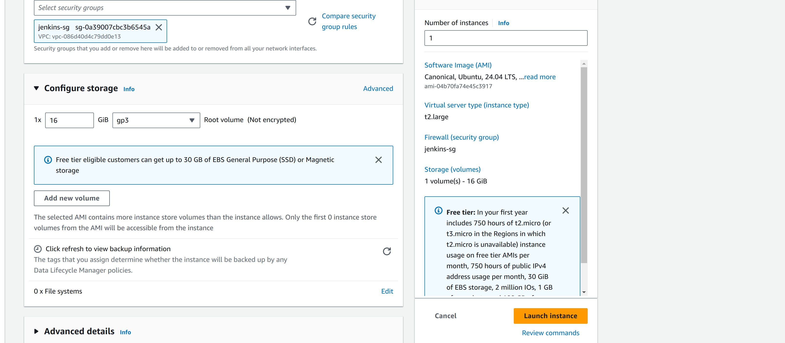

### Step 02 - Connect EC2 Machine  

Connect to your EC2 Ubuntu Machine using SSH. Make sure you're in the root user or use 'sudo'.

```shell
$ sudo ssh -i "key.pem" ubuntu@<ip-address>

```
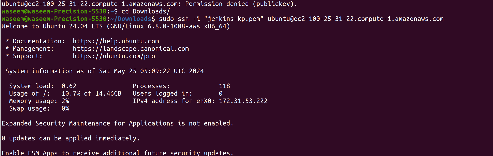


### Step 03 - Installation of Jenkins

Install Jenkins either manually or using container-based installation. Here's the container-based installation command.

```shell
$ docker run -p 8080:8080 -p 50000:50000 -d \
-v jenkins_home:/var/jenkins_home \
-v /var/run/docker.sock:/var/run/docker.sock \
-v $(which docker):/usr/bin/docker jenkins/jenkins:lts
```
or you can install directly on server Ec2 machine.

```shell
sudo wget -O /usr/share/keyrings/jenkins-keyring.asc \
  https://pkg.jenkins.io/debian-stable/jenkins.io-2023.key
echo "deb [signed-by=/usr/share/keyrings/jenkins-keyring.asc]" \
  https://pkg.jenkins.io/debian-stable binary/ | sudo tee \
  /etc/apt/sources.list.d/jenkins.list > /dev/null
sudo apt-get update
sudo apt-get install jenkins

sudo systemctl enable jenkins
sudo systemctl start jenkins
sudo systemctl status jenkins
```
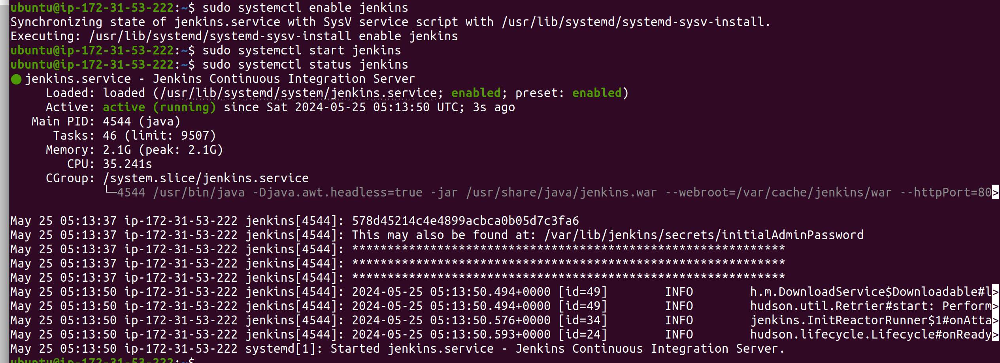

Here is the Jenkins Installation URL : https://www.jenkins.io/doc/book/installing/linux/

### Step 04 - Installation of Java - JDK

```shell
sudo apt update
sudo apt install fontconfig openjdk-17-jre
java -version
openjdk version "17.0.8" 2023-07-18
OpenJDK Runtime Environment (build 17.0.8+7-Debian-1deb12u1)
OpenJDK 64-Bit Server VM (build 17.0.8+7-Debian-1deb12u1, mixed mode, sharing)

```

### Step 05 - Access Jenkins

```shell
Jenkins server access ur : <server-ip>:portno
e.g : http: 192.168.0.1:8080
```
Now, In order to access the Jenkins server, first you need to get the Jenkins password

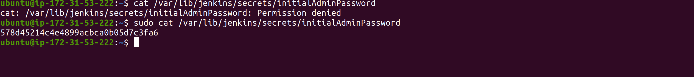
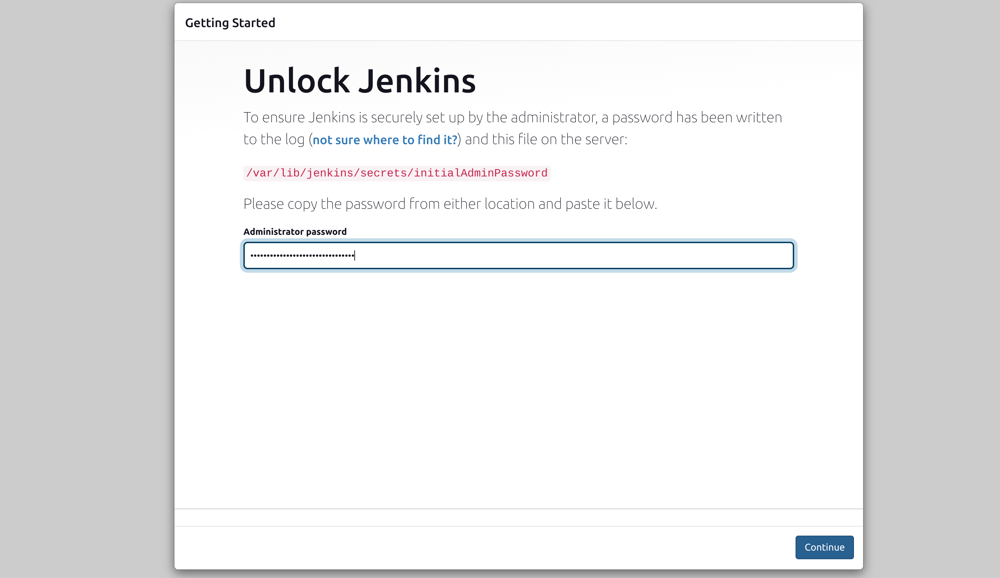
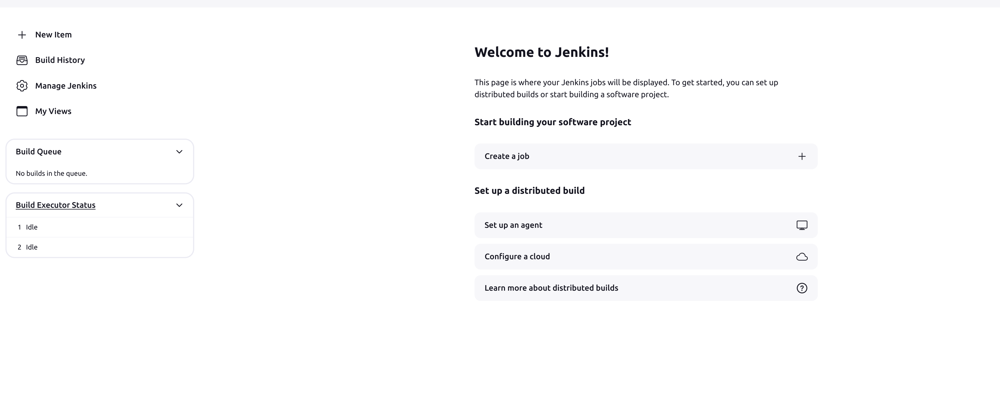

Now that we have setup our EC2 server, Docker, and Jenkins, let's create a simple Jenkins pipeline.

Before creating the pipeline, ensure your Git repository is up to date. Use the following links to update.

- 💾 [End-to-End-CICD](https://github.com/waseemuddin/CICD_Projects.git)

Log in to Jenkins using the password generated during setup


### Step 06 - Create Pipeline

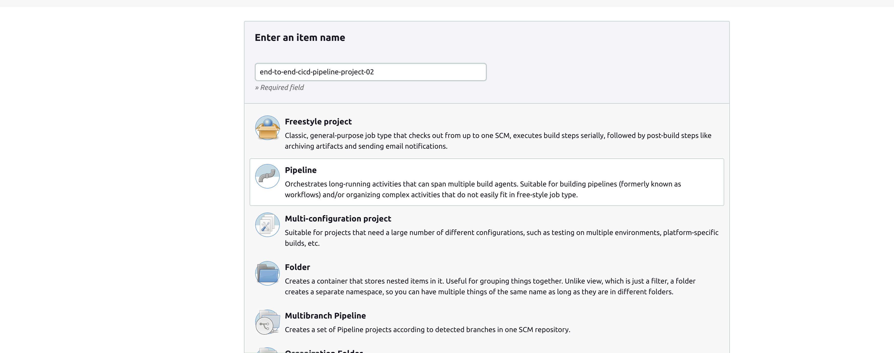

Pileline steps are same as we created in Project - 01 - [](https://github.com/waseemuddin/simple-cicd-project01.git)


### Step 07 - Install Plugins

Now next step is to install some pluings. Goto Manage jenkins and click plugin and install availabale plugins

1. **docker pipeline**: 
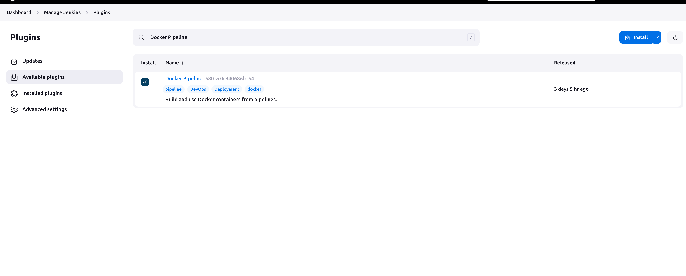


2. **sinarqube scanner** 
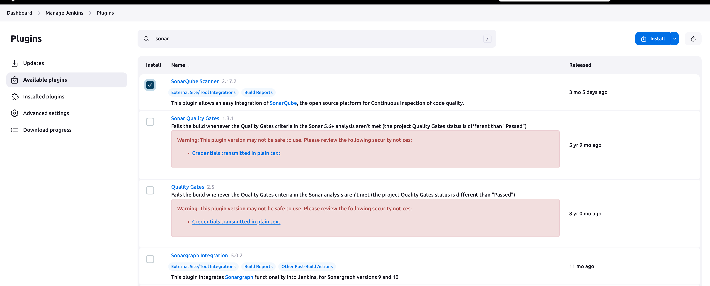


### Step 08 - Installation of SonarQube

``` shell
apt install unzip
adduser sonarqube
wget https://binaries.sonarsource.com/Distribution/sonarqube/sonarqube-9.4.0.54424.zip
unzip *
chmod -R 755 /home/sonarqube/sonarqube-9.4.0.54424
chown -R sonarqube:sonarqube /home/sonarqube/sonarqube-9.4.0.54424
cd sonarqube-9.4.0.54424/bin/linux-x86-64/
./sonar.sh start

```
Now you can access the SonarQube Server on http://<ip-address>:9000

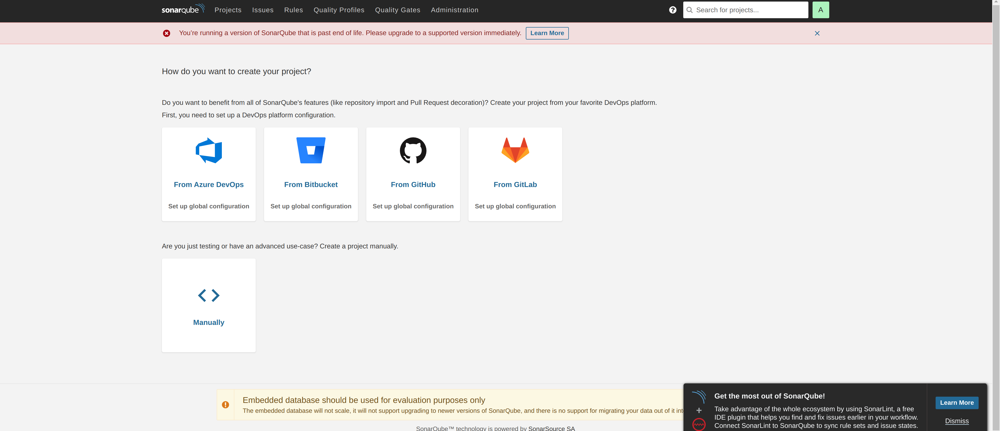

Now in order to commnucate the Sonar-Server with Jenkins we need to create sonar-token id and made it available to jenkins credentails

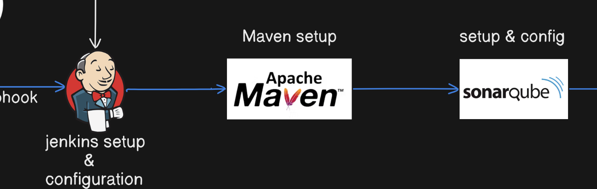

Sonar - Server Token

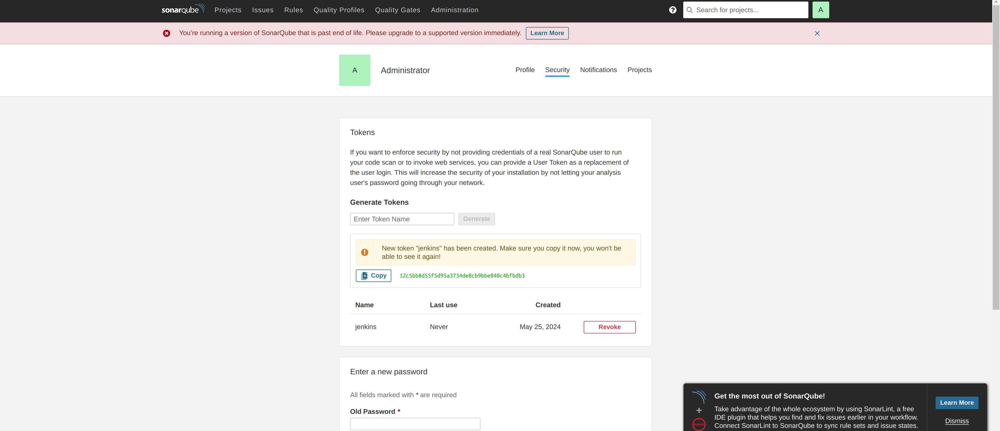 

Jenkins credentails for sonar-secret token

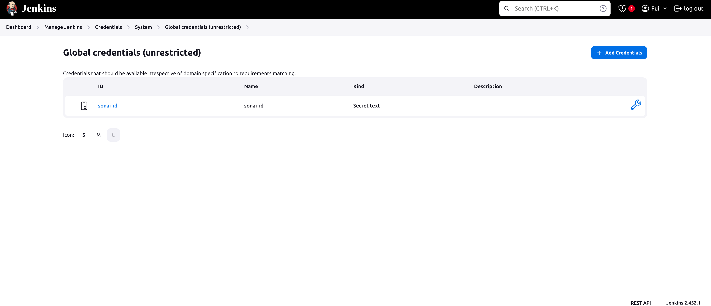 

### Step 08 - Installation of docker

docker installation link : https://docs.docker.com/engine/install/ubuntu/

```shell 

# Add Docker's official GPG key:
sudo apt-get update
sudo apt-get install ca-certificates curl
sudo install -m 0755 -d /etc/apt/keyrings
sudo curl -fsSL https://download.docker.com/linux/ubuntu/gpg -o /etc/apt/keyrings/docker.asc
sudo chmod a+r /etc/apt/keyrings/docker.asc

# Add the repository to Apt sources:
echo \
  "deb [arch=$(dpkg --print-architecture) signed-by=/etc/apt/keyrings/docker.asc] https://download.docker.com/linux/ubuntu \
  $(. /etc/os-release && echo "$VERSION_CODENAME") stable" | \
  sudo tee /etc/apt/sources.list.d/docker.list > /dev/null
sudo apt-get update
```
```shell
sudo apt-get install docker-ce docker-ce-cli containerd.io docker-buildx-plugin docker-compose-plugin
```

### Step 09 - Jenkins Github Secrets

In order to update the deployment file dynamically you need to create the Github secrets key

Goto Github prpfile and setting. 
Create classic token id 

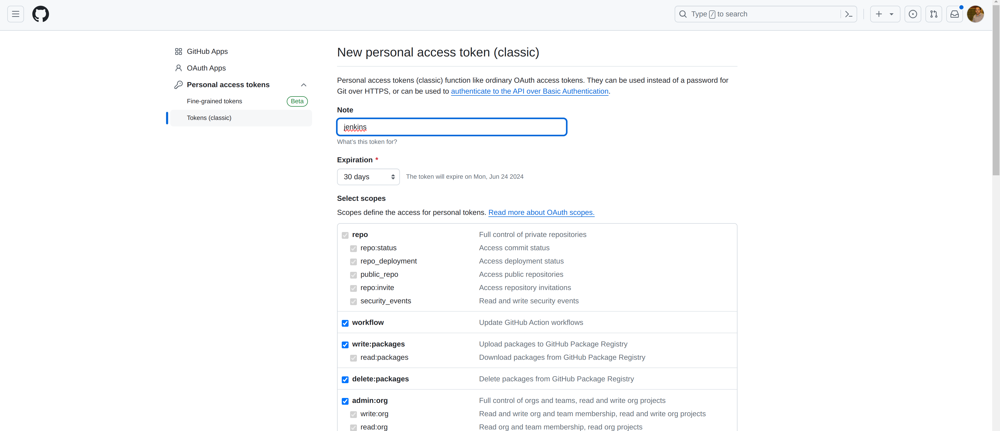 


### Step 09 - Build Pipeline Code

In order to Build/Run the pipleline, please double check your Jenkinsfile Code 

```shell

pipeline {
  agent {
    docker {
      image 'waseem63/maven-docker-agent:v1'
      args '--user root -v /var/run/docker.sock:/var/run/docker.sock' //  Docker socket to access the host's Docker daemon
    }
  }
  stages {
    stage('Checkout') {
      steps {
        sh 'echo passed'
        //git branch: 'main', url: 'https://github.com/iam-veeramalla/Jenkins-Zero-To-Hero.git'
      }
    }
    stage('Build and Test') {
      steps {
        sh 'ls -ltr'
        // build the project and create a JAR file
        sh 'cd java-maven-sonar-argocd-helm-k8s/spring-boot-app && mvn clean package'
      }
    }
    stage('Static Code Analysis') {
      environment {
        SONAR_URL = "http://100.25.31.22:9000"
      }
      steps {
        withCredentials([string(credentialsId: 'sonar-id', variable: 'SONAR_AUTH_TOKEN')]) {
          sh 'cd java-maven-sonar-argocd-helm-k8s/spring-boot-app && mvn sonar:sonar -Dsonar.login=$SONAR_AUTH_TOKEN -Dsonar.host.url=${SONAR_URL}'
        }
      }
    }
    stage('Build and Push Docker Image') {
      environment {
        DOCKER_IMAGE = "waseem63/cicd-pipeline-project-two:${BUILD_NUMBER}"
        // DOCKERFILE_LOCATION = "java-maven-sonar-argocd-helm-k8s/spring-boot-app/Dockerfile"
        REGISTRY_CREDENTIALS = credentials('docker-hub-id')
      }
      steps {
        script {
            sh 'cd java-maven-sonar-argocd-helm-k8s/spring-boot-app && docker build -t ${DOCKER_IMAGE} .'
            def dockerImage = docker.image("${DOCKER_IMAGE}")
            docker.withRegistry('https://index.docker.io/v1/', "docker-hub-id") {
                dockerImage.push()
            }
        }
      }
    }
    stage('Update Deployment File') {
        environment {
            GIT_REPO_NAME = "CICD_Projects"
            GIT_USER_NAME = "waseemuddin"
        }
        steps {
            withCredentials([string(credentialsId: 'github-key-new', variable: 'GITHUB_TOKEN')]) {
                sh '''
                    git config user.email "waseem.uddin@live.com "
                    git config user.name "waseemuddin"
                    BUILD_NUMBER=${BUILD_NUMBER}
                    sed -i "s/replaceImageTag/${BUILD_NUMBER}/g" java-maven-sonar-argocd-helm-k8s/spring-boot-app-manifests/deployment.yml
                    git add java-maven-sonar-argocd-helm-k8s/spring-boot-app-manifests/deployment.yml
                    git commit -m "Update deployment image to version ${BUILD_NUMBER}"
                    git push https://${GITHUB_TOKEN}@github.com/${GIT_USER_NAME}/${GIT_REPO_NAME} HEAD:main
                '''
            }
        }
    }
  }
}
```


3. **Jenkins Setup**: You can either manually install Jenkins or use a Jenkins image.
4. **GitHub Account**: You need a GitHub account to automate the pipeline.
5. **Kubernetes cluster** : (Minikube is fine)
5. **Argo CD** : (usig Argo CD operator operatorhub.com)

